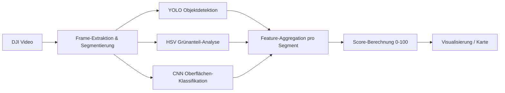

# Bikeability Score – Egocentric Vision für die automatisierte Bewertung von Radinfrastruktur

> Masterprojekt im Modul **Bildverarbeitung und Bildverstehen**
> Studiengang Data Science & AI – DHBW

Automatisierte Bewertung der Fahrradfreundlichkeit (*Bikeability*) von Streckenabschnitten
auf Basis von egozentrischem Videomaterial (DJI-Kamera am Lenker). Aus den Videos werden
mittels **Computer Vision** und **Deep Learning** (YOLO, HSV-Farbraumanalyse) Merkmale
extrahiert und zu einem kontinuierlichen **Bikeability-Score (0–100)** pro Streckenabschnitt
aggregiert.

---

## 1. Motivation & Zielsetzung

Aktive Mobilität (Radverkehr) gewinnt für nachhaltige Stadtplanung zunehmend an Bedeutung.
Klassische Bikeability-Indizes basieren auf manuellen Erhebungen oder Geodaten. Dieses Projekt
untersucht, ob sich die **Attraktivität einer Fahrradstrecke automatisiert aus der
Ich-Perspektive (Egocentric Vision)** ableiten lässt.


**Zielgröße:** Eine kontinuierliche Variable – der *Bikeability-Score* $A \in [0, 100]$ –
pro Streckensegment (zeitbasiert: 10 s, oder distanzbasiert: 100 m).

Das ursprüngliche Ziel (Erkennung von „Gefahrensituationen“) wurde verworfen, da es sich
nicht trennscharf und reproduzierbar labeln lässt. Der Score-Ansatz liefert dagegen klar
definierte, messbare Merkmale.

---

## 2. Datengrundlage

| Eigenschaft        | Wert                                                        |
| ------------------ | ----------------------------------------------------------- |
| Aufnahmegerät      | DJI-Kamera, frontal am Fahrradlenker montiert               |
| Umfang             | ca. 5–6 Stunden Videomaterial                               |
| Perspektive        | Egocentric / First-Person View                              |
| Segmentierung      | zeitbasiert (10 s) **oder** distanzbasiert (100 m)          |
| GPS                | optional – ermöglicht kartenbasierte Visualisierung         |

> Bei z. B. 30 fps und ~20 km/h entspricht ein 100-m-Abschnitt ca. **540 Frames**, die zu
> einem Feature-Vektor aggregiert werden.

📦 **Bereits erstellter Datensatz:** [Google Drive](https://drive.google.com/drive/folders/1cMV4_znMxJ1V4L5ZnJUUq9dNIdBuOYaO?usp=sharing)

---

## 3. Methodik

### 3.1 Score-Modell

Der Score wird als **gewichtete Summe** positiver und negativer Einflussfaktoren definiert:

$$
A = \sum_i \left( w_i^{+} \cdot F_i^{+} \right) - \sum_j \left( w_j^{-} \cdot F_j^{-} \right)
$$

Alle Features werden auf $[0, 1]$ normalisiert und anschließend auf die Skala 0–100 abgebildet.

### 3.2 Feature-Extraktion

| Parameter                    | CV-Methode                                  | Datentyp        | Einfluss        |
| ---------------------------- | ------------------------------------------- | --------------- | --------------- |
| Motorisierter Verkehr $V_m$  | YOLOv8 (Klassen: car, truck, bus)           | Integer (Count) | stark negativ   |
| Vulnerable Teilnehmer $V_v$  | YOLOv8 (Klasse: person, bicycle)            | Integer (Count) | leicht negativ  |
| Parkende Fahrzeuge $P_{door}$| YOLO (rechter Bildrand)                     | Integer (Count) | negativ         |
| Fahrbahnoberfläche $O_{surf}$| CNN-Klassifikation (ResNet/EfficientNet)    | Kategorie       | negativ b. Schäden |
| Effektive Spurbreite $B_{space}$ | Canny/Hough oder Segmentierung          | Float           | negativ b. Enge |
| Grünvolumen-Index (GVI)      | HSV-Thresholding (obere Bildhälfte)         | Float (0–1)     | positiv         |
| Sky View Factor (SVF)        | Maskensegmentierung Himmel                  | Float (0–1)     | positiv         |

**Positive Features** (Score ↑): baulich getrennte, asphaltierte Radwege mit klarer
Abgrenzung und breiter Spur; Grünanteil/Natur (Bäume, Parks, Wiesen); Aussicht (Seen, Berge).

**Negative Features** (Score ↓): hohes motorisiertes Verkehrsaufkommen; Hindernisse
(Blockaden, Schranken, Baustellen, Engstellen); schlechte Oberfläche (Kopfsteinpflaster,
Schlaglöcher, Schotter).

### 3.3 Pipeline



---

## 4. Edge-Deployment (NVIDIA Jetson Nano)

Das Scoring-Modell läuft als **Edge-AI-System** in Echtzeit auf einem NVIDIA Jetson Nano und
zeigt den aktuellen Score während der Fahrt auf einem kleinen Display an.

**Optimierungen für Echtzeit:**

- Export des trainierten YOLO-Modells nach **TensorRT** (`.engine`) zur Nutzung der CUDA-Kerne.
- Reduzierte Input-Auflösung (`imgsz=320` oder `416`).
- Multi-Threading, damit die Display-Ausgabe den Inferenz-Thread nicht blockiert.

**Display:** 3,5–5" HDMI-Touchscreen (Bild via HDMI, Strom/Touch via USB) – verhält sich wie
ein Standardmonitor, Ausgabe via OpenCV im Vollbildmodus.

**Stromversorgung:** Powerbank mit Power Delivery (PD); instabiler Strom führt bei GPU-Last zu
Abstürzen.

### Beispiel: Echtzeit-Overlay (vereinfacht)

```python
import cv2
from ultralytics import YOLO

model = YOLO("models/yolov8n.engine")   # TensorRT-optimiert
cap = cv2.VideoCapture(0)
score = 100.0

while cap.isOpened():
    success, frame = cap.read()
    if not success:
        break

    results = model(frame, verbose=False)
    car_count = sum(1 for box in results[0].boxes if int(box.cls) == 2)  # COCO class 2 = car

    score = max(0, score - car_count * 5)  # Platzhalter-Heuristik

    cv2.rectangle(frame, (10, 10), (300, 80), (0, 0, 0), -1)
    cv2.putText(frame, f"BIKE SCORE: {int(score)}/100", (20, 45),
                cv2.FONT_HERSHEY_SIMPLEX, 1, (0, 255, 0), 2)
    cv2.putText(frame, f"Cars detected: {car_count}", (20, 70),
                cv2.FONT_HERSHEY_SIMPLEX, 0.6, (255, 255, 255), 1)

    cv2.imshow("Jetson Bike Display", frame)
    if cv2.waitKey(1) & 0xFF == ord("q"):
        break

cap.release()
cv2.destroyAllWindows()
```

---

## 5. Installation & Nutzung

```bash
# Repository klonen
git clone https://github.com/<username>/computer_vision_bikeability_score.git
cd computer_vision_bikeability_score

# Abhängigkeiten installieren
pip install -r requirements.txt

# Notebook starten
jupyter lab notebooks/
```

---

## 6. Evaluation

Die Auswertung vergleicht zwei kontrastierende Streckenabschnitte aus dem Videomaterial
(z. B. **Fahrt durch den Wald** vs. **Fahrt an einer Hauptstraße**):

- Darstellung der extrahierten Features als Zeitreihe pro Segment.
- Vergleich der aggregierten Bikeability-Scores.
- Kartenbasierte, farbkodierte Darstellung des Score-Verlaufs (sofern GPS-Daten vorliegen).

Für die Objektdetektion gelten Standardmetriken (mAP@50, mAP@50–95); für die
Oberflächen-Klassifikation Accuracy, F1-Score und Confusion Matrix.

---

## 7. Aufbau des Papers (4 Seiten)

1. **Abstract** – Kurzfassung der Methodik zur automatisierten Bewertung von Radinfrastruktur
   mittels Egocentric Vision.
2. **Introduction & Related Work** – Relevanz aktiver Mobilität, bestehende Bikeability-Indizes.
3. **Methodology** – Feature-Extraktion (YOLO, HSV), mathematische Definition des
   Scoring-Modells, Begründung der Gewichtung $w$.
4. **Evaluation & Results** – Vergleich zweier Streckenabschnitte, Feature-Zeitreihen.
5. **Conclusion** – Limitationen (z. B. Wetter-/Helligkeitsabhängigkeit der Grünerkennung),
   Ausblick. Stichworte: *Edge AI, TensorRT-Latenzoptimierung, HMI für Radfahrer*.

---

## 8. Limitationen

- Grün- und Himmelserkennung ist abhängig von Wetter, Tageszeit und Belichtung.
- HSV-Schwellwerte sind szenenabhängig und müssen ggf. kalibriert werden.
- Distanzschätzung aus Monokular-Video ist nur ein Proxy (relative Bounding-Box-Größe).
- Die Gewichte $w$ sind heuristisch und nicht datengetrieben validiert.

---

## 9. Tech-Stack

- **Computer Vision:** Ultralytics YOLOv8/YOLOv10, OpenCV
- **Deep Learning:** PyTorch, ResNet/EfficientNet (Oberflächen-Klassifikation)
- **Edge AI:** NVIDIA Jetson Nano, TensorRT
- **Analyse:** Python, NumPy, pandas, Matplotlib, Jupyter

---

## 10. Ressourcen

- 📊 Miro-Mindmap: [Projekt-Board](https://miro.com/welcomeonboard/M0ozRVhXNE50ZEE2cXJpVy9mZzk1S1ZHeVFEcDNETTY0UllyMlIvenh5NEZtTVdSMGpHT0lqQnRTRlE0NjJnRm02MUltZjdtNGxLYTl1QUpvOVU5TlJXdFFJSThCak1FR00yVXRPaVhEcEd1aW03NjNqYit3OGpqRGxjbzl4eUhBS2NFMDFkcUNFSnM0d3FEN050ekl3PT0hdjE=?share_link_id=549246225146)
- 📦 Datensatz: [Google Drive](https://drive.google.com/drive/folders/1cMV4_znMxJ1V4L5ZnJUUq9dNIdBuOYaO?usp=sharing)

---

*Dieses Projekt entstand im Rahmen des Mastermoduls „Bildverarbeitung und Bildverstehen“.*
