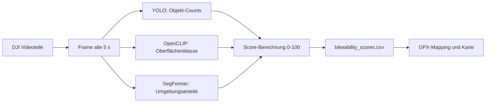

# A Computer-Vision-Based Bikeability Score

Automatisierte Bewertung der Fahrradfreundlichkeit (*Bikeability*) von Streckenabschnitten
auf Basis von egozentrischem Videomaterial (DJI-Kamera am Lenker). Aus den Frames werden
mit **Computer Vision** drei Merkmalsgruppen extrahiert und pro Frame zu einem
kontinuierlichen **Bikeability-Score (0–100)** kombiniert.

---

## 1. Motivation & Zielsetzung

Aktive Mobilität (Radverkehr) gewinnt für nachhaltige Stadtplanung an Bedeutung. Klassische
Bikeability-Indizes basieren auf manuellen Erhebungen oder Geodaten. Dieses Projekt
untersucht, ob sich die Attraktivität einer Fahrradstrecke automatisiert aus der
Ich-Perspektive (Egocentric Vision) ableiten lässt.

**Zielgröße:** ein kontinuierlicher *Bikeability-Score* $A \in [0, 100]$ pro Frame, der über
die GPS-Zeitachse auf den Streckenverlauf gemappt wird.

---

## 2. Datengrundlage

| Eigenschaft   | Wert                                                     |
| ------------- | -------------------------------------------------------- |
| Aufnahmegerät | DJI-Kamera, frontal am Fahrradlenker montiert            |
| Umfang        | ca. 10-11 Stunden Videomaterial (in mehrere `.MP4` geteilt) |
| Perspektive   | Egocentric / First-Person View                           |
| Abtastung     | ein Frame alle **5 Sekunden**                            |
| GPS           | GPX-Track – ermöglicht die kartenbasierte Visualisierung |

📦 **Datensatz:** [Google Drive](https://drive.google.com/drive/folders/1cMV4_znMxJ1V4L5ZnJUUq9dNIdBuOYaO?usp=sharing)

---

## 3. Methodik

Der Score setzt sich aus **drei Teilkomponenten** zusammen, die jeweils von einem eigenen
Modell stammen. Alle Detektoren liegen in [final_bikeability_score/detectors](final_bikeability_score/detectors)
und werden einmal geladen und pro Frame wiederverwendet.

| Komponente             | Modell                                              | Ausgabe pro Frame                                  |
| ---------------------- | --------------------------------------------------- | -------------------------------------------------- |
| **Object Detection**   | YOLO (Ultralytics, `yolo26n.pt`)                    | Counts: `bicycle`, `car`, `traffic light`          |
| **Ground Detection**   | OpenCLIP `ViT-B/32` (zero-shot, Prompt-Ensembling)  | One-Hot: `Cycleway`, `Road`, `Gravel`, `Unpaved`   |
| **Environment**        | fine-tuned **SegFormer-B0** (semant. Segmentierung) | Flächenanteile: `vegetation`, `water`, `city`      |

### 3.1 Score-Modell

Die drei Subscores werden über feste Gewichte (Summe = 1) kombiniert; dadurch bleibt der
Score **garantiert** in $[0, 100]$:

$$
A = 100 \cdot \left( w_g \cdot S_{\text{ground}} + w_e \cdot S_{\text{env}} + w_o \cdot S_{\text{object}} \right)
$$

mit $w_g = 0.20$, $w_e = 0.45$, $w_o = 0.35$.

- **Ground-Subscore** $S_{\text{ground}}$: Skalarprodukt des One-Hot-Vektors mit dem
  Qualitätsvektor `[1.0, 0.7, 0.3, 0.1]` (Cycleway → Unpaved).
- **Env-Subscore** $S_{\text{env}}$: mit den Flächenanteilen gewichtetes Mittel der
  Klassenqualität `[1.0, 1.0, 0.4]` (vegetation, water, city); neutral `0.5`, falls keine
  Klasse erkannt wird.
- **Object-Subscore** $S_{\text{object}} = e^{-\max(0,\ \langle \text{counts}, \lambda\rangle)}$
  mit Straf-/Bonusfaktoren `[-0.2, 1.0, 0.3]` – Räder wirken positiv, Autos am stärksten
  negativ.

> Die Gewichte und Bewertungstabellen sind heuristisch gewählt.

### 3.2 Pipeline



---

## 4. Projektstruktur

```
├── README.md
├── final_bikeability_score/          # Finale End-to-End-Pipeline (Deliverable)
│   ├── bikeability_score.ipynb       # Haupt-Notebook: Video -> Score -> Karte
│   ├── detectors/                    # ground / environment / object + env_model.py
│   ├── requirements.txt              # Abhängigkeiten der Pipeline
│   ├── yolov8s.pt                    # YOLO-Gewichte
│   ├── dataset/                      # input_videos/, input_gpx/
│   └── output/                       # bikeability_scores.csv, score_with_gpx.csv, Karte
├── research/                         # Experimente & Modellentwicklung
│   ├── environment_model/            # SegFormer: Training & Evaluation
│   ├── ground_detection/             # Oberflächen-/Straßenerkennung (CLIP-Benchmark)
│   ├── Object_Detection/             # YOLO-Experimente
│   ├── models/segformer_env/         # Trainiertes SegFormer-Modell (von final referenziert)
│   ├── dataset/                      # Beispiel-/Evaluationsdaten
│   └── requirements.txt              # Schlanke Abhängigkeiten für die Research-Skripte
└── paper/                            # LaTeX-Quellen des Papers
```

---

## 5. Installation & Nutzung

Empfohlene Python-Version: **3.10+**. Der `.venv/`-Ordner wird **nicht** eingecheckt –
committet wird nur die `requirements.txt`.

**Windows (PowerShell):**

```powershell
python -m venv .venv
.venv\Scripts\Activate.ps1
pip install -r final_bikeability_score/requirements.txt
```

> Bei einem Ausführungsrichtlinien-Fehler einmalig:
> `Set-ExecutionPolicy -Scope CurrentUser -ExecutionPolicy RemoteSigned`

**macOS / Linux (bash/zsh):**

```bash
python3 -m venv .venv
source .venv/bin/activate
pip install -r final_bikeability_score/requirements.txt
```

> Für die Research-Skripte genügt die schlanke `research/requirements.txt`.

### Pipeline ausführen

1. Videoteile nach `final_bikeability_score/dataset/input_videos/` legen (DJI teilt eine
   Aufnahme in mehrere Dateien auf – alle Teile werden chronologisch als **ein**
   durchgehendes Video verarbeitet).
2. Optional den GPX-Track nach `dataset/input_gpx/` legen.
3. Notebook starten und ausführen:

```bash
jupyter lab final_bikeability_score/bikeability_score.ipynb
```

Ergebnisse landen in `final_bikeability_score/output/`: `bikeability_scores.csv` (Score pro
Frame), `score_with_gpx.csv` (mit GPS-Punkten gemergt) und `bikeability_map.png` (farbkodierte
Karte, `RdYlGn`: 0 = rot, 100 = grün).

> **Hinweis:** Die Kamera-Uhr der DJI ist unzuverlässig; die Startzeit wird über einen
> manuellen Sync-Punkt (Standard: Aufnahme-Start = GPX-Start) bestimmt.

---

## 6. Evaluation

- **Object Detection:** Standardmetriken (mAP@50, mAP@50–95).
- **Ground Detection:** Zero-shot-CLIP-Varianten per macro-F1 verglichen
  (`research/ground_detection/`); Gewinner: `ViT-B/32`, `laion2b_s34b_b79k`.
- **Environment:** fine-tuned SegFormer-B0 schlägt Zero-shot-CLIP auf 1.210 eigenen
  POV-Frames (macro-F1 0.704 vs. 0.649, Label-Accuracy 0.911 vs. 0.888).
- **Score:** Vergleich kontrastierender Abschnitte (z. B. Waldweg vs. Hauptstraße) als
  Feature-Zeitreihe und als farbkodierter Score-Verlauf auf der Karte.

---

## 7. Limitationen

- Umgebungs- und Oberflächenerkennung sind abhängig von Wetter, Tageszeit und Belichtung.
- Die Gewichte und Bewertungstabellen sind heuristisch, nicht datengetrieben validiert.
- Die zeitliche Zuordnung Score ↔ GPS beruht auf einem manuellen Sync-Punkt.

---

## 8. Tech-Stack

- **Computer Vision:** Ultralytics YOLO, OpenCLIP, OpenCV
- **Deep Learning:** PyTorch, Hugging Face Transformers (SegFormer)
- **Analyse:** Python, NumPy, pandas, Matplotlib, Jupyter

---

## 9. Ressourcen

- 📊 Miro-Mindmap: [Projekt-Board](https://miro.com/welcomeonboard/M0ozRVhXNE50ZEE2cXJpVy9mZzk1S1ZHeVFEcDNETTY0UllyMlIvenh5NEZtTVdSMGpHT0lqQnRTRlE0NjJnRm02MUltZjdtNGxLYTl1QUpvOVU5TlJXdFFJSThCak1FR00yVXRPaVhEcEd1aW03NjNqYit3OGpqRGxjbzl4eUhBS2NFMDFkcUNFSnM0d3FEN050ekl3PT0hdjE=?share_link_id=549246225146)
- 📦 Datensatz: [Google Drive](https://drive.google.com/drive/folders/1cMV4_znMxJ1V4L5ZnJUUq9dNIdBuOYaO?usp=sharing)

---

*Dieses Projekt entstand im Rahmen des Mastermoduls „Bildverarbeitung und Bildverstehen".*
